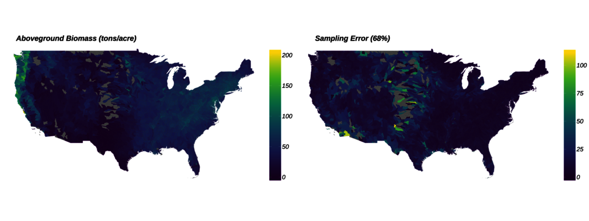
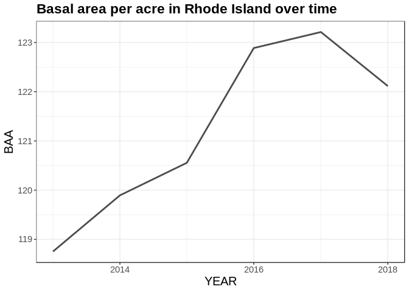
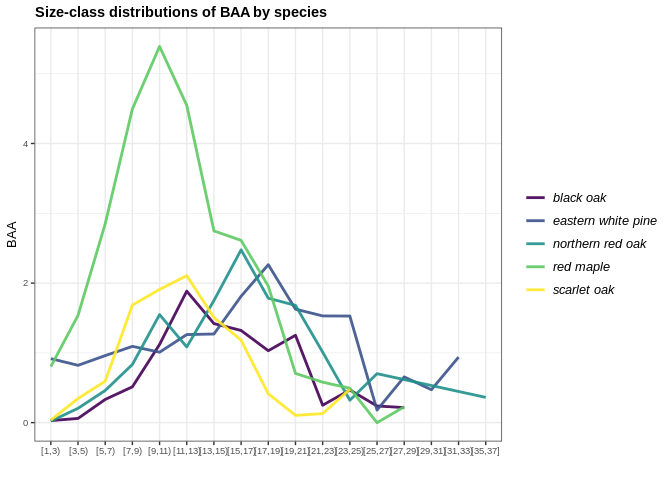
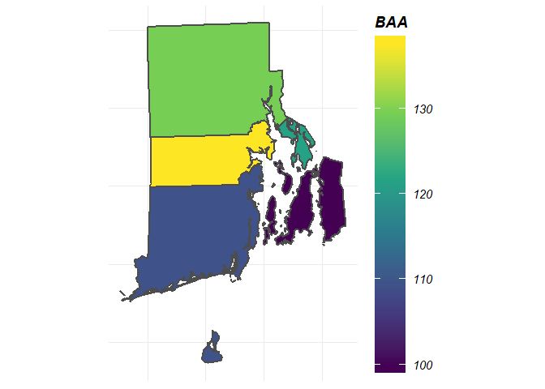
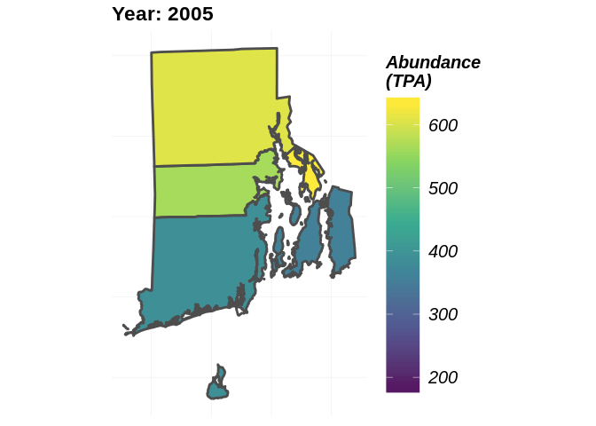

<!-- README.md is generated from README.Rmd. Please edit that file -->

# rFIA: Unlocking the FIA Database in R

<!-- badges: start -->

[](https://cran.r-project.org/package=rFIA)
[](https://cran.r-project.org/package=rFIA)
[](https://travis-ci.org/hunter-stanke/rFIA)
[](https://www.tidyverse.org/lifecycle/#maturing)
<!-- badges: end -->



The goal of `rFIA` is to increase the accessibility and use of the USFS
Forest Inventory and Analysis (FIA) Database by providing a
user-friendly, open source platform to easily query and analyze FIA
Data. Designed to accommodate a wide range of potential user objectives,
`rFIA` simplifies the estimation of forest variables from the FIA
Database and allows all R users (experts and newcomers alike) to unlock
the flexibility and potential inherent to the Enhanced FIA design.

Specifically, `rFIA` improves accessibility to the spatio-temporal
estimation capacity of the FIA Database by producing space-time indexed
summaries of forest variables within user-defined population boundaries.
Direct integration with other popular R packages (e.g., dplyr, sp, and
sf) facilitates efficient space-time query and data summary, and
supports common data representations and API design. The package
implements design-based estimation procedures outlined by Bechtold &
Patterson (2005), and has been validated against estimates and sampling
errors produced by EVALIDator. Current development is focused on the
implementation of spatially-enabled model-assisted estimators to improve
population, change, and ratio estimates.

<br>

## Installation

You can install the released version of `rFIA` from
[CRAN](https://CRAN.R-project.org) with:

``` r
install.packages("rFIA")
```

Alternatively, you can install the development version from
GitHub:

``` r
devtools::install_github('hunter-stanke/rFIA')
```

<br>

## Functionality

| `rFIA` Function | Description                                                        |
| --------------- | ------------------------------------------------------------------ |
| `area`          | Estimate land area                                                 |
| `biomass`       | Estimate volume, biomass, & carbon stocks of standing trees        |
| `clipFIA`       | Spatial & temporal queries                                         |
| `diversity`     | Estimate species diversity                                         |
| `dwm`           | Estimate volume, biomass, and carbon stocks of down woody material |
| `getFIA`        | Download FIA data, load into R, and optionally save to disk        |
| `growMort`      | Estimate recruitment, mortality, and harvest rates                 |
| `invasive`      | Estimate areal coverage of invasive species                        |
| `plotFIA`       | Produce static & animated plots of spatial FIA summaries           |
| `readFIA`       | Load FIA database into R environment                               |
| `seedling`      | Estimate seedling abundance (TPA)                                  |
| `standStruct`   | Estimate forest structural stage distributions                     |
| `tpa`           | Estimate abundance of standing trees (TPA & BAA)                   |
| `vitalRates`    | Estimate live tree growth rates                                    |

<br>

## Example Usage

### *Download FIA Data and Load into R*

The first step to using `rFIA` is to download subsets of the FIA
Database. The easiest way to accomplish this is using `getFIA`. Using
one line of code, you can download state subsets of the FIA Database,
load data into your R environment, and optionally save those data to a
local directory for future
use\!

``` r
## Download the state subset or Connecticut (requires an internet connection)
# All data acquired from FIA Datamart: https://apps.fs.usda.gov/fia/datamart/datamart.html
ct <- getFIA(states = 'CT', dir = '/path/to/save/data')
```

By default, `getFIA` only loads the portions of the database required to
produce summaries with other `rFIA` functions (`common = TRUE`). This
conserves memory on your machine and speeds download time. If you would
like to download all available tables for a state, simple specify
`common = FALSE` in the call to `getFIA`.

**But what if I want to load multiple states worth of FIA data into R?**
No problem\! Simply specify mutiple state abbreviations in the `states`
argument of `getFIA` (e.g. `states = c('MI', 'IN', 'WI', 'IL'`)), and
all state subsets will be downloaded and merged into a single
`FIA.Database` object. This will allow you to use other `rFIA` functions
to produce estimates within polygons which straddle state boundaries\!

Note: given the massive size of the full FIA Database, users are
cautioned to only download the subsets containing their region of
interest.

**If you have previously downloaded FIA data would simply like to load
into R from a local directory, use `readFIA`:**

``` r
## Load FIA Data from a local directory
db <- readFIA('/path/to/your/directory/')
```

-----

### *Compute Estimates of Forest Variables*

Now that you have loaded your FIA data into R, it’s time to put it to
work. Let’s explore the basic functionality of `rFIA` with `tpa`, a
function to compute tree abundance estimates (TPA, BAA, & relative
abundance) from FIA data, and `fiaRI`, a subset of the FIA Database for
Rhode Island including inventories from 2013-2018.

**Estimate the abundance of live trees in Rhode Island:**

``` r
library(rFIA)
## Load the Rhode Island subset of the FIADB (included w/ rFIA)
## NOTE: This object can be produced using getFIA and/or readFIA
data("fiaRI")

## Only estimates for the most recent inventory year
fiaRI_MR <- clipFIA(fiaRI, mostRecent = TRUE) ## subset the most recent data
tpaRI_MR <- tpa(fiaRI_MR)
head(tpaRI_MR)
#> # A tibble: 1 x 11
#>    YEAR   TPA   BAA TPA_PERC BAA_PERC TPA_SE BAA_SE TPA_PERC_SE BAA_PERC_SE
#>   <int> <dbl> <dbl>    <dbl>    <dbl>  <dbl>  <dbl>       <dbl>       <dbl>
#> 1  2018  427.  122.     93.2     93.7   6.63   3.06        7.62        4.48
#> # … with 2 more variables: nPlots_TREE <dbl>, nPlots_AREA <dbl>

## All Inventory Years Available (i.e., returns a time series)
tpaRI <- tpa(fiaRI)

## Time Series plot
plotFIA(tpaRI, BAA, se = TRUE,
        plot.title = 'Basal area per acre in Rhode Island over time')
```



**What if I want to group estimates by species? How about by size
class?**

``` r
## Group estimates by species
tpaRI_species <- tpa(fiaRI_MR, bySpecies = TRUE)
head(tpaRI_species, n = 3)
#> # A tibble: 3 x 14
#>    YEAR  SPCD COMMON_NAME SCIENTIFIC_NAME    TPA    BAA TPA_PERC BAA_PERC
#>   <int> <int> <chr>       <chr>            <dbl>  <dbl>    <dbl>    <dbl>
#> 1  2018    12 balsam fir  Abies balsamea  0.0873 0.0295   0.0191   0.0226
#> 2  2018    43 Atlantic w… Chamaecyparis … 0.247  0.180    0.0539   0.138 
#> 3  2018    68 eastern re… Juniperus virg… 1.14   0.138    0.249    0.106 
#> # … with 6 more variables: TPA_SE <dbl>, BAA_SE <dbl>, TPA_PERC_SE <dbl>,
#> #   BAA_PERC_SE <dbl>, nPlots_TREE <dbl>, nPlots_AREA <dbl>

## Group estimates by size class
## NOTE: Default 2-inch size classes, but you can make your own using makeClasses()
tpaRI_sizeClass <- tpa(fiaRI_MR, bySizeClass = TRUE)
head(tpaRI_sizeClass, n = 3)
#> # A tibble: 3 x 12
#>    YEAR sizeClass   TPA   BAA TPA_PERC BAA_PERC TPA_SE BAA_SE TPA_PERC_SE
#>   <int>     <dbl> <dbl> <dbl>    <dbl>    <dbl>  <dbl>  <dbl>       <dbl>
#> 1  2018         1 188.   3.57     41.0     2.74  13.0   12.8         6.39
#> 2  2018         3  68.6  5.76     15.0     4.42  15.1   15.8         6.39
#> 3  2018         5  46.5  9.06     10.2     6.95   6.51   6.57        6.38
#> # … with 3 more variables: BAA_PERC_SE <dbl>, nPlots_TREE <dbl>,
#> #   nPlots_AREA <dbl>

## Group by species and size class, and plot the distribution 
##  for the most recent inventory year
tpaRI_spsc <- tpa(fiaRI_MR, bySpecies = TRUE, bySizeClass = TRUE)
plotFIA(tpaRI_spsc, BAA, grp = COMMON_NAME, x = sizeClass,
        plot.title = 'Size-class distributions of BAA by species', 
        x.lab = 'Size Class (inches)', text.size = .75,
        n.max = 5) # Only want the top 5 species, try n.max = -5 for bottom 5
```



**What if I want estimates for a specific type of tree (ex. greater than
12-inches DBH and in a canopy dominant or subdominant position) in
specific area (ex. growing on mesic sites), and I want to group by
estimates by some variable other than species or size class (ex.
ownsership group)?** Easy\! Each of these specifications are described
in the FIA Database, and all `rFIA` functions can leverage these data to
easily implement complex
queries\!

``` r
## grpBy specifies what to group estimates by (just like species and size class above)
## treeDomain describes the trees of interest, in terms of FIA variables 
## areaDomain, just like above,describes the land area of interest
tpaRI_own <- tpa(fiaRI_MR, 
                     grpBy = OWNGRPCD, 
                     treeDomain = DIA > 12 & CCLCD %in% c(1,2),
                     areaDomain = PHYSCLCD %in% c(20:29))
head(tpaRI_own)
#> # A tibble: 2 x 12
#>    YEAR OWNGRPCD   TPA   BAA TPA_PERC BAA_PERC TPA_SE BAA_SE TPA_PERC_SE
#>   <int>    <int> <dbl> <dbl>    <dbl>    <dbl>  <dbl>  <dbl>       <dbl>
#> 1  2018       30 0.848  3.57     20.8     29.3   59.0   59.1        24.7
#> 2  2018       40 1.49   3.99     79.2     70.7   25.7   27.7        24.7
#> # … with 3 more variables: BAA_PERC_SE <dbl>, nPlots_TREE <dbl>,
#> #   nPlots_AREA <dbl>
```

**What if I want to produce estimates within my own population
boundaries (within user-defined spatial zones/polygons)?** This is where
things get really exciting.

``` r
## Load the county boundaries for Rhode Island
data('countiesRI') ## Load your own spatial data from shapefiles using readOGR() (rgdal)

## polys specifies the polygons (zones) where you are interested in producing estimates
## returnSpatial = TRUE indicates that the resulting estimates will be joined with the 
##    polygons we specified, thus allowing us to visualize the estimates across space
tpaRI_counties <- tpa(fiaRI_MR, polys = countiesRI, returnSpatial = TRUE)

## NOTE: Any grey polygons below simply means no FIA data was available for that region
plotFIA(tpaRI_counties, BAA) # Plotting method for spatial FIA summaries, also try 'TPA' or 'TPA_PERC'
```



**We produced a really cool time series earlier, how would I marry the
spatial and temporal capacity of `rFIA` to produce estimates across
user-defined polygons and through time?** Easy\! Just hand `tpa` the
full FIA.Database object you produced with `readFIA` (not the most
recent subset produced with `clipFIA`). For stunning space-time
visualizations, hand the output of `tpa` to `plotFIA`. To save the
animation as a .gif file, simpy specify `fileName` (name of output file)
and `savePath` (directory to save file, combined with `fileName`).

``` r
## Using the full FIA dataset, all available inventories
tpaRI_st <- tpa(fiaRI, polys = countiesRI, returnSpatial = TRUE)

## Animate the output
plotFIA(tpaRI_st, TPA, animate = TRUE, legend.title = 'Abundance (TPA)', legend.height = .8)
```


