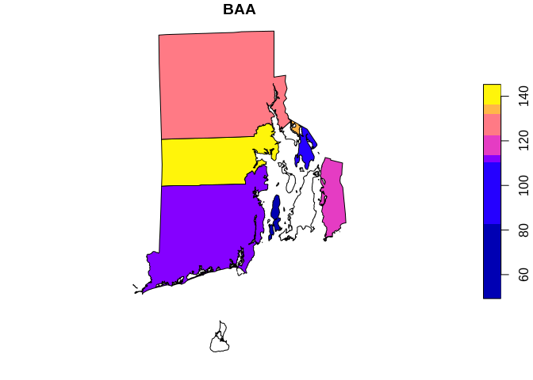
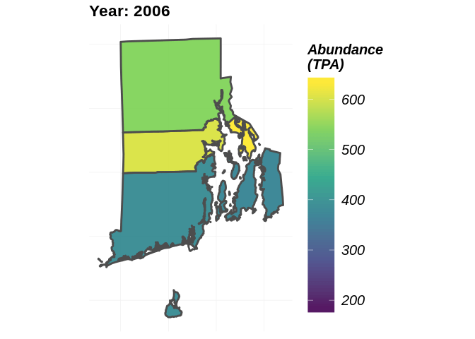

<!-- README.md is generated from README.Rmd. Please edit that file -->

# rFIA: Unlocking the FIA Database in R

<!-- badges: start -->

<!-- badges: end -->

The goal of `rFIA` is to increase the accessibility and use of the USFS
Forest Inventory and Analysis (FIA) Database by providing a
user-friendly, open source platform to easily query and analyze FIA
Data. Designed to accommodate a wide range of potential user objectives,
`rFIA` simplifies the estimation of forest variables from the FIA
Database and allows all R users (experts and newcomers alike) to unlock
the flexibility and potential inherent to the Enhanced FIA design.

Specifically, `rFIA` improves accessibility to the spatio-temporal
estimation capacity of the FIA Database by producing space-time indexed
summaries of forest variables within user-defined population boundaries.
Direct integration with other popular R packages (e.g., dplyr, sp, and
sf) facilitates efficient space-time query and data summary, and
supports common data representations and API design. The package
implements design-based estimation procedures outlined by Bechtold &
Patterson (2005), and has been validated against estimates and sampling
errors produced by EVALIDator. Current development is focused on the
implementation of spatially-enabled model-assisted estimators to improve
population, change, and ratio estimates.

You can download subsets of the FIA Database at the FIA Datamart:
<https://apps.fs.usda.gov/fia/datamart/CSV/datamart_csv.html>

## Installation

You can install the released version of `rFIA` from
[CRAN](https://CRAN.R-project.org) with:

``` r
install.packages("rFIA")
```

Alternatively, you can install the development version from
GitHub:

``` r
devtools::install_github('hunter-stanke/rFIA')
```

## Functionality

| `rFIA` Function | Description                                                        |
| --------------- | ------------------------------------------------------------------ |
| `biomass`       | Estimate volume, biomass, & carbon stocks of standing trees        |
| `clipFIA`       | Spatial & temporal queries                                         |
| `diversity`     | Estimate species diversity                                         |
| `dwm`           | Estimate volume, biomass, and carbon stocks of down woody material |
| `growMort`      | Estimate recruitment, mortality, and harvest rates                 |
| `invasive`      | Estimate areal coverage of invasive species                        |
| `plotFIA`       | Produce static & animated plots of spatial FIA summaries           |
| `readFIA`       | Load FIA database into R environment                               |
| `standStruct`   | Estimate forest structural stage distributions                     |
| `tpa`           | Estimate abundance of standing trees (TPA & BAA)                   |
| `vitalRates`    | Estimate live tree growth rates                                    |

## Example Usage

#### *Load FIA Data into R*

The first step to using `rFIA` is to download subsets of the FIA
Database from the FIA Datamart. Download a state subset by clicking the
state of interest here:
<https://apps.fs.usda.gov/fia/datamart/CSV/datamart_csv.html>.

Note: given the massive size of the full FIA Database, users are
cautioned to only download the subsets containing their region of
interest.

Once downloaded, simply unzip the files in thier own directory (all
files in the same directory, with no non-FIA files present), and load
the database into r using `readFIA`:

``` r
## Load FIA Data from a local directory
db <- readFIA('/path/to/your/directory/')
```

By default, readFIA only loads the portions of the database required to
produce summaries with `rFIA` functions (common = TRUE)

**But what if I want to load multiple states worth of FIA data into R?**
No problem\! Simply unzip the files from each state download and place
them in the same directory. Point `readFIA` to this directory, and it
will load and merge the states into a single `FIA.Database` object. This
will allow you to use other `rFIA` functions to produce estimates within
polygons which straddle state boundaries\!

-----

#### *Compute Estimates of Forest Variables*

Now that you have loaded your FIA data into R, it’s time to put it to
work. Let’s explore the basic functionality of `rFIA` with `tpa`, a
function to compute tree abundance estimates (TPA, BAA, & relative
abundance) from FIA data, and `fiaRI`, a subset of the FIA Database for
Rhode Island including all inventories up to 2017.

**Estimate the abundance of live trees in Rhode Island:**

``` r
library(rFIA)
## Load the Rhode Island subset of the FIADB (included w/ rFIA)
## NOTE: This object was produced using readFIA
data("fiaRI")

## All Inventory Years Available (i.e., returns a time series)
tpaRI <- tpa(fiaRI)
## 2005 marks the first reporting year of the annual inventory, prior data is sparse
head(tpaRI[tpaRI$YEAR >= 2005,]) 
#>   YEAR      TPA      BAA TPA_PERC BAA_PERC    TPA_SE   BAA_SE TPA_PERC_SE
#> 3 2005 515.5744 111.6125 96.84389 93.59710 10.615234 3.890772   13.440383
#> 4 2006 495.8962 110.6405 96.95192 93.89178  8.852613 3.227646    9.758828
#> 5 2007 501.0436 111.5937 96.85846 94.18505  6.892173 3.288470    7.738193
#> 6 2008 499.4036 114.5062 96.96246 94.63488  6.856534 3.363525    7.838763
#> 7 2009 516.1721 115.5236 97.05357 94.78673  6.860511 3.206383    7.816539
#> 8 2010 504.2760 117.9255 96.88600 94.90083  6.949872 3.185564    8.007664
#>   BAA_PERC_SE nPlots_TREE nPlots_AREA
#> 3   10.030967          66          67
#> 4    5.743451          93          95
#> 5    5.139181         125         126
#> 6    5.166261         121         122
#> 7    5.211263         116         118
#> 8    5.096559         118         119

## Only estimates for the most recent inventory year
fiaRI_MR <- clipFIA(fiaRI, mostRecent = TRUE) ## subset the most recent data
tpaRI_MR <- tpa(fiaRI_MR)
head(tpaRI_MR)
#>   YEAR      TPA      BAA TPA_PERC BAA_PERC   TPA_SE   BAA_SE TPA_PERC_SE
#> 1 2017 441.1381 123.2122 95.38343  94.6289 6.658465 3.012546     7.65795
#>   BAA_PERC_SE nPlots_TREE nPlots_AREA
#> 1    4.486253         124         125
```

**What if I want to group estimates by species? How about by size
class?**

``` r
## Group estimates by species
tpaRI_species <- tpa(fiaRI_MR, bySpecies = TRUE)
head(tpaRI_species)
#>   YEAR SPCD          COMMON_NAME        SCIENTIFIC_NAME         TPA
#> 1 2017   12           balsam fir         Abies balsamea  0.08543602
#> 2 2017   43 Atlantic white-cedar Chamaecyparis thyoides  0.25204548
#> 3 2017   68     eastern redcedar   Juniperus virginiana  1.14522403
#> 4 2017   96          blue spruce          Picea pungens  0.00000000
#> 5 2017  126           pitch pine           Pinus rigida  5.61221361
#> 6 2017  129   eastern white pine          Pinus strobus 88.81302010
#>           BAA    TPA_PERC    BAA_PERC    TPA_SE    BAA_SE TPA_PERC_SE
#> 1  0.02882013  0.01847308  0.02213431 116.12825 116.12825    7.745135
#> 2  0.18331354  0.05449759  0.14078767  58.76023  55.63951    7.680104
#> 3  0.13385013  0.24762176  0.10279899  64.41035  65.79782    7.684579
#> 4  0.00000000  0.00000000  0.00000000       NaN       NaN         NaN
#> 5  2.62237604  1.21347979  2.01402584  52.14526  47.70844    7.675459
#> 6 21.13144131 19.20326138 16.22927759  22.96060  16.94912    7.661078
#>   BAA_PERC_SE nPlots_TREE nPlots_AREA
#> 1    4.634001           1         125
#> 2    4.520513           3         125
#> 3    4.534002           5         125
#> 4         NaN           0         125
#> 5    4.511541           9         125
#> 6    4.489357          61         125

## Group estimates by size class
## NOTE: Default 2-inch size classes, but you can make your own using makeClasses()
tpaRI_sizeClass <- tpa(fiaRI_MR, bySizeClass = TRUE)
head(tpaRI_sizeClass)
#>   YEAR sizeClass       TPA       BAA  TPA_PERC  BAA_PERC    TPA_SE
#> 1 2017     [1,3) 195.25111  3.596043 42.217437  2.761817 12.732747
#> 2 2017     [3,5)  72.39459  6.049452 15.653248  4.646074 15.210451
#> 3 2017     [5,7)  47.82755  9.296152 10.341332  7.139590  6.373852
#> 4 2017     [7,9)  39.39137 13.477907  8.517251 10.351243  6.334300
#> 5 2017    [9,11)  28.72466 15.357160  6.210882 11.794539  5.383093
#> 6 2017   [11,13)  21.16278 16.224021  4.575842 12.460302  6.170071
#>      BAA_SE TPA_PERC_SE BAA_PERC_SE nPlots_TREE nPlots_AREA
#> 1 11.559701    7.658755    4.487675          75         125
#> 2 15.883538    7.659167    4.488987          44         125
#> 3  6.442474    7.657892    4.486617         113         125
#> 4  6.335178    7.657888    4.486603         112         125
#> 5  5.462446    7.657817    4.486490         111         125
#> 6  6.183912    7.657872    4.486581         104         125
```

**What if I want estimates for a specific type of tree (ex. greater than
12-inches DBH and in a canopy dominant or subdominant position) in
specific area (ex. growing on mesic sites), and I want to group by
estimates by some variable other than species or size class (ex.
ownsership group)?** Easy\! Each of these specifications are described
in the FIA Database, and all `rFIA` functions can leverage these data to
easily implement complex
queries\!

``` r
## grpBy specifies what to group estimates by (just like species and size class above)
## treeDomain describes the trees of interest, in terms of FIA variables 
## areaDomain, just like above,describes the land area of interest
tpaRI_own <- tpa(fiaRI_MR, 
                     grpBy = 'OWNGRPCD', 
                     treeDomain = DIA > 12 & CCLCD %in% c(1,2),
                     areaDomain = PHYSCLCD %in% c(20:29))
head(tpaRI_own)
#>   YEAR OWNGRPCD      TPA      BAA TPA_PERC BAA_PERC   TPA_SE   BAA_SE
#> 1 2017       30 1.238332 4.783645      100      100 49.84574 49.34242
#> 2 2017       40 1.435430 3.737055      100      100 24.80016 26.94152
#> 3 2017       NA      NaN      NaN      NaN      NaN      NaN      NaN
#>   TPA_PERC_SE BAA_PERC_SE nPlots_TREE nPlots_AREA
#> 1    51.46922    50.95504           4          38
#> 2    26.04668    27.89684          12          80
#> 3         NaN         NaN           0           0
```

**What if I want to produce estimates within my own population
boundaries (within user-defined spatial zones/polygons)?** This is where
things get really exciting.

``` r
## Load the county boundaries for Rhode Island
library(rFIA)
data('countiesRI') ## Load your own spatial data from shapefiles using readOGR() (rgdal)

## polys specifies the polygons (zones) where you are interested in producing estimates
## returnSpatial = TRUE indicates that the resulting estimates will be joined with the 
##    polygons we specified, thus allowing us to visualize the estimates across space
tpaRI_counties <- tpa(fiaRI_MR, polys = countiesRI, returnSpatial = TRUE)

## NOTE: Any grey polygons below simply means no FIA data was available for that region
plotFIA(tpaRI_counties, 'BAA') # Plotting method for spatial FIA summaries, also try 'TPA' or 'TPA_PERC'
```



**We produced a really cool time series earlier, how would I marry the
spatial and temporal capacity of `rFIA` to produce estimates across
user-defined polygons and through time?** Easy\! Just hand `tpa` the
full FIA.Database object you produced with `readFIA` (not the most
recent subset produced with `clipFIA`). For stunning space-time
visualizations, hand the output of `tpa` to `plotFIA`. To save the
animation as a .gif file, simpy specify `fileName` (name of output file)
and `savePath` (directory to save file, combined with `fileName`).

``` r
## Using the full FIA dataset, all available inventories
tpaRI_st <- tpa(fiaRI, polys = countiesRI, returnSpatial = TRUE)

## Animate the output
plotFIA(tpaRI_st, 'TPA', animate = TRUE, title = 'Abundance (TPA)', legend.height = .8)
```


